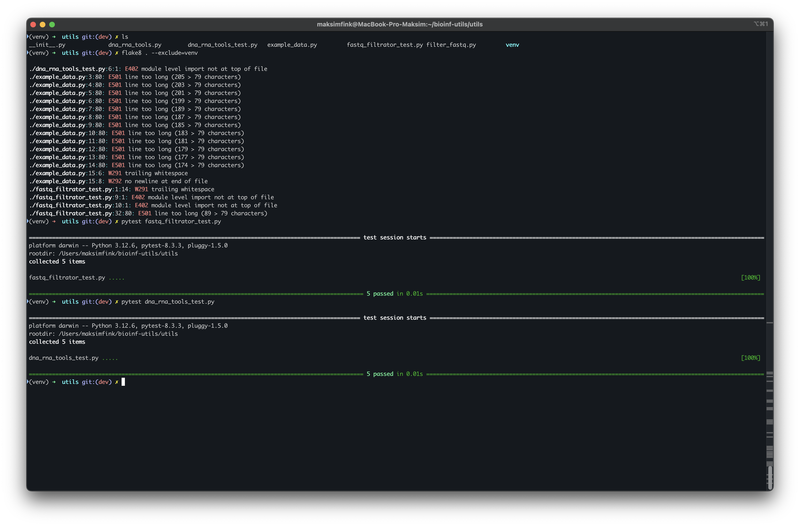

# Bioinformatics Utilities

## Описание

Этот проект предоставляет набор утилит для работы с ДНК и РНК последовательностями, а также для фильтрации FASTQ-файлов. Основные функции проекта:

- **run_dna_rna_tools** — набор инструментов для работы с ДНК/РНК последовательностями (транскрипция, комплементарность, реверс и другие операции).
- **filter_fastq** — утилита для фильтрации FASTQ последовательностей по критериям GC-состава, длины и качества.

## Установка

1. Склонируйте репозиторий:
    ```bash
    git clone https://github.com/The-AGT/bioinf-utils.git
    ```

2. Перейдите в директорию проекта:
    ```bash
    cd bioinf-utils
    ```

3. Установите виртуальное окружение (рекомендуется):
    ```bash
    python -m venv venv
    source venv/bin/activate  # для Windows: venv\Scripts\activate
    ```

4. Установите зависимости (если они есть):
    ```bash
    pip install -r requirements.txt
    ```

## Использование

### 1. run_dna_rna_tools

Функция `run_dna_rna_tools` позволяет выполнять операции над ДНК и РНК последовательностями, такие как транскрипция, реверс, комплементарность и вычисление GC-содержания.

#### Пример использования:
```python
from main_script import run_dna_rna_tools

sequences = ["ATGC", "CGTGA"]
procedure = "reverse_complement"
result = run_dna_rna_tools(*sequences, procedure)
print(result)
```

#### Доступные процедуры:
- `transcribe` — транскрипция ДНК в РНК (замена T на U).
- `reverse` — реверс последовательности.
- `complement` — комплементарная последовательность.
- `reverse_complement` — реверс комплементарной последовательности.
- `gc_content` — вычисление содержания G и C в последовательности.

### 2. filter_fastq

Функция `filter_fastq` используется для фильтрации FASTQ последовательностей по критериям GC-состава, длины и среднего качества.

#### Аргументы:
- **seqs** — словарь с последовательностями в формате FASTQ (ключ — имя, значение — кортеж из последовательности и качества).
- **gc_bounds** — интервал GC-состава для фильтрации (по умолчанию (0, 100)).
- **length_bounds** — интервал длины для фильтрации (по умолчанию (0, 2**32)).
- **quality_threshold** — пороговое значение среднего качества (по умолчанию 0).

#### Пример использования:
```python
from main_script import filter_fastq

seqs = {
    "seq1": ("ATGC", "IIII"),
    "seq2": ("CGTGA", "HHHHH")
}

gc_bounds = (40, 60)
length_bounds = (4, 10)
quality_threshold = 30

filtered_seqs = filter_fastq(seqs, gc_bounds, length_bounds, quality_threshold)
print(filtered_seqs)
```

## Структура проекта

```
bioinf-utils/
├─README.md
├─main_script.py
├─utils/
│├── __init__.py
│├── dna_rna_tools_test.py
│├── fastq_filtrator_test.py
│└── example_data.py
```

## Скриншоты

Ниже приведён скриншот результатов тестов:


```
